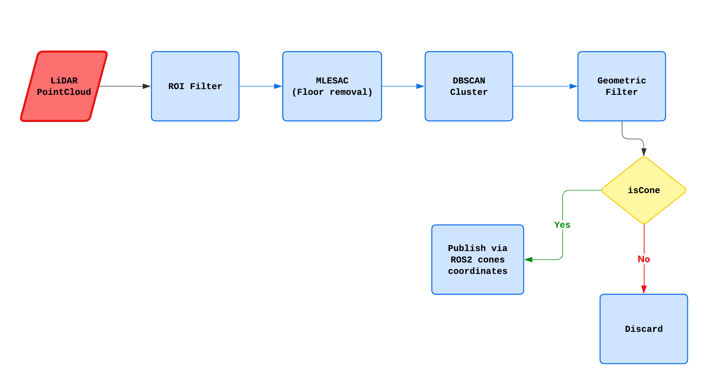
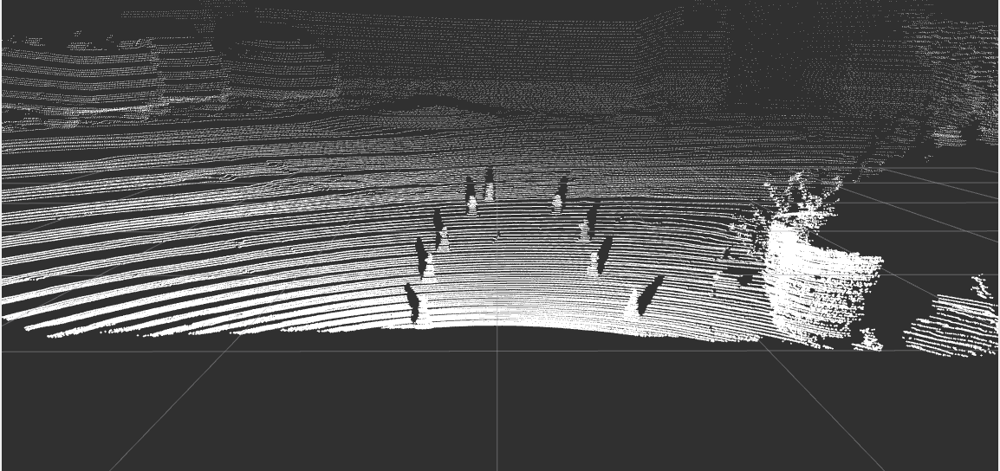
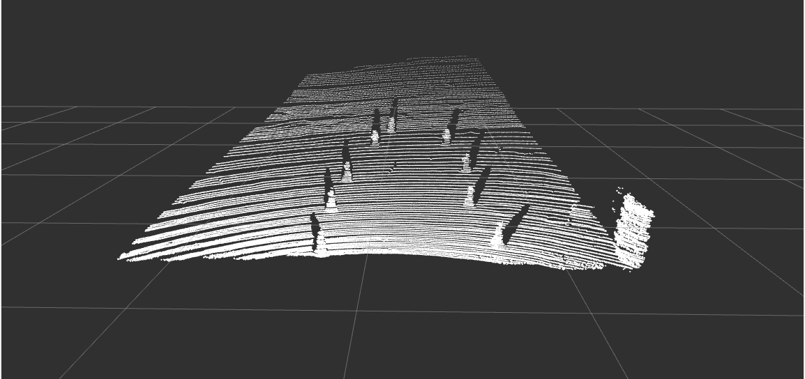

# LiDAR Cone Detector
This pipeline is used to detect cones in a PointCloud2 message, a data structure obtained from a LiDAR sensor.
# Motivation
In the Formula SAE Student Competition, the track is delimited by cones of two different colors: yellow and blue. While it is possible to detect the cones' positions using cameras, LiDAR provides significantly higher precision and reliability. Therefore, we use LiDAR data to detect the cones that define the track boundaries.
# Pipeline Architecture

# How it works
## ROI Filter
The first step in our pipeline is applying a *Region of Interest (ROI)* filter, which limits the area of the scene to be processed. This significantly reduces the number of points by removing those that are clearly irrelevant, such as points belonging to the sky.

  
  

