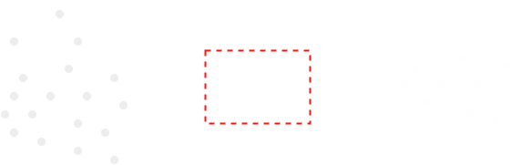
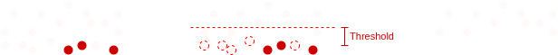

# LiDAR CONE DETECTON
This pipeline is used to detect cones in a PointCloud2 message, a data structure obtained from a LiDAR sensor.
## Motivation
In the Formula SAE Student Competition, the track is delimited by cones of two different colors: yellow and blue. While it is possible to detect the cones' positions using cameras, LiDAR provides significantly higher precision and reliability. Therefore, we use LiDAR data to detect the cones that define the track boundaries.
## Pipeline Architecture

## How it works
### 1. ROI Filter

The first step in our pipeline is applying a *Region of Interest (ROI)* filter, which limits the area of the scene to be processed.  
This significantly reduces the number of points by removing those that are clearly irrelevant, such as points belonging to the sky.

  

It basically defines a 3D rectangular region within the point cloud received from the LiDAR, using predefined limits in the x, y, and z dimensions. Any point outside this region is excluded from the pipeline.

### 2. MLESAC
MLESAC is a variation of the RANSAC algorithm, which is widely used today due to its effectiveness in robust model fitting. In our case, we use MLESAC to identify the plane that best represents the ground surface in the point cloud. Once this plane is detected, it is removed from the data.
The core idea of the algorithm is simple: it repeatedly samples three random points to define a candidate plane, and then counts how many other points (called **inliers**) lie within a predefined distance threshold from that plane. The plane with the highest number of inliers is assumed to correspond to the ground.

  

This significantly reduces the number of points that need to be processed and increases the likelihood of detecting cones, as it eliminates much of the noise from irrelevant ground points.