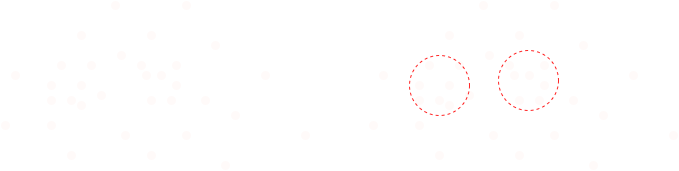
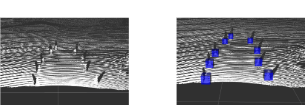

# LiDAR CONE DETECTON
This pipeline is used to detect cones in a PointCloud2 message, a data structure obtained from a LiDAR sensor.
## Motivation
In the Formula SAE Student Competition, the track is delimited by cones of two different colors: yellow and blue. While it is possible to detect the cones' positions using cameras, LiDAR provides significantly higher precision and reliability. Therefore, we use LiDAR data to detect the cones that define the track boundaries.
## Pipeline Architecture

## How it works
### 1. ROI Filter

The first step in our pipeline is applying a *Region of Interest (ROI)* filter, which limits the area of the scene to be processed.  
This significantly reduces the number of points by removing those that are clearly irrelevant, such as points belonging to the sky.

  

It basically defines a 3D rectangular region within the point cloud received from the LiDAR, using predefined limits in the x, y, and z dimensions. Any point outside this region is excluded from the pipeline.

### 2. MLESAC
MLESAC is a variation of the RANSAC algorithm, which is widely used today due to its effectiveness in robust model fitting. In our case, we use MLESAC to identify the plane that best represents the ground surface in the point cloud. Once this plane is detected, it is removed from the data.
The core idea of the algorithm is simple: it repeatedly samples three random points to define a candidate plane, and then counts how many other points (called **inliers**) lie within a predefined distance threshold from that plane. The plane with the highest number of inliers is assumed to correspond to the ground.

 

  

 
This significantly reduces the number of points that need to be processed and increases the likelihood of detecting cones, as it eliminates much of the noise from irrelevant ground points.

### 3. DBSCAN
After applying the region of interest (ROI) filter and removing the ground plane, the next step is to accurately identify the cones present in the scene. To achieve this, we employ the **DBSCAN** clustering algorithm, followed by a set of geometric validation filters.

**DBSCAN** (*Density-Based Spatial Clustering of Applications with Noise*) is a density-based clustering method that identifies clusters as areas of high point density separated by regions of low density. In our context, these dense regions within the 3D LiDAR point cloud likely correspond to cones placed on the track to define its boundaries.
 

  

 
However, DBSCAN alone is not sufficient, as it may also cluster spurious objects—such as a discarded water bottle or debris on the road—as valid cones due to their high local point density. To address this issue and improve robustness, we apply two additional filters:

1. **Geometric Fitting Filter**: For each cluster identified by DBSCAN, we attempt to fit a geometric model corresponding to the expected shape of a cone. If the fitting error exceeds a predefined threshold or if the shape is inconsistent with known cone dimensions (e.g., height-to-base ratio), the cluster is discarded.

2. **Axial Symmetry Filter**: Traffic cones are symmetric around their vertical axis. We evaluate the spatial distribution of points in each cluster to verify this symmetry. Clusters that exhibit significant asymmetry are considered false positives and are also removed.

By combining density-based clustering with geometric and symmetry validation, we construct a highly reliable and precise pipeline for detecting cones using LiDAR data. This approach significantly reduces false detections and enhances the autonomy and safety of our perception system.

## Results
 

  

 

## How to use